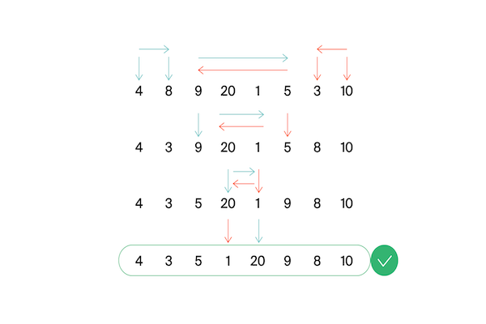

<h1 align="center">B. Эффективная быстрая сортировка</h1>

<h5 align="center">
<a href="#limits">Ограничения</a>
•
<a href="#task">Условие задачи</a>
•
<a href="#input">Формат ввода</a>
•
<a href="#output">Формат вывода</a>
•
<a href="#examples">Примеры</a>
•
<a href="#solution">Решение</a>
</h5>

<br>

<table id="limits">
<tbody>
<tr>
<td>
<b>Ограничение времени</b>
</td>
<td>
2 секунды
</td>
</tr>
<tr>
<td>
<b>Ограничение памяти</b>
</td>
<td>
64Mb
</td>
</tr>
<tr>
<td>
<b>Ввод</b>
</td>
<td>
стандартный ввод или input.txt
</td>
</tr>
<tr>
<td>
<b>Вывод</b>
</td>
<td>
стандартный вывод или output.txt
</td>
</tr>
</tbody>
</table>

<h2 id="task">Условие задачи</h2>

Тимофей решил организовать соревнование по спортивному программированию, чтобы найти талантливых стажёров. Задачи подобраны, участники зарегистрированы, тесты написаны. Осталось придумать, как в конце соревнования будет определяться победитель.

Каждый участник имеет уникальный логин. Когда соревнование закончится, к нему будут привязаны два показателя: количество решённых задач Pi и размер штрафа Fi. Штраф начисляется за неудачные попытки и время, затраченное на задачу.

Тимофей решил сортировать таблицу результатов следующим образом: при сравнении двух участников выше будет идти тот, у которого решено больше задач. При равенстве числа решённых задач первым идёт участник с меньшим штрафом. Если же и штрафы совпадают, то первым будет тот, у которого логин идёт раньше в алфавитном (лексикографическом) порядке.

Тимофей заказал толстовки для победителей и накануне поехал за ними в магазин. В своё отсутствие он поручил вам реализовать алгоритм быстрой сортировки (англ. quick sort) для таблицы результатов. Так как Тимофей любит спортивное программирование и не любит зря расходовать оперативную память, то ваша реализация сортировки не может потреблять O(n) дополнительной памяти для промежуточных данных (такая модификация быстрой сортировки называется "in-place").

Как работает in-place quick sort
Как и в случае обычной быстрой сортировки, которая использует дополнительную память, необходимо выбрать опорный элемент (англ. pivot), а затем переупорядочить массив. Сделаем так, чтобы сначала шли элементы, не превосходящие опорного, а затем —– большие опорного.

Затем сортировка вызывается рекурсивно для двух полученных частей. Именно на этапе разделения элементов на группы в обычном алгоритме используется дополнительная память. Теперь разберёмся, как реализовать этот шаг in-place.

Пусть мы как-то выбрали опорный элемент. Заведём два указателя left и right, которые изначально будут указывать на левый и правый концы отрезка соответственно. Затем будем двигать левый указатель вправо до тех пор, пока он указывает на элемент, меньший опорного. Аналогично двигаем правый указатель влево, пока он стоит на элементе, превосходящем опорный. В итоге окажется, что что левее от left все элементы точно принадлежат первой группе, а правее от right — второй. Элементы, на которых стоят указатели, нарушают порядок. Поменяем их местами (в большинстве языков программирования используется функция swap()) и продвинем указатели на следующие элементы. Будем повторять это действие до тех пор, пока left и right не столкнутся.
На рисунке представлен пример разделения при pivot=5. Указатель left — голубой, right — оранжевый.



<h2 id="input">Формат ввода</h2>

В первой строке задано число участников n, 1 ≤ n ≤ 100 000.
В каждой из следующих n строк задана информация про одного из участников.
i-й участник описывается тремя параметрами:

уникальным логином (строкой из маленьких латинских букв длиной не более 20)
числом решённых задач Pi
штрафом Fi
Fi и Pi — целые числа, лежащие в диапазоне от 0 до 109.

<h2 id="output">Формат вывода</h2>

Для отсортированного списка участников выведите по порядку их логины по одному в строке.

<h2 id="examples">Примеры</h2>

<h4>Пример 1</h4>
<ul>
<h6>Ввод</h6>
<pre>
5
alla 4 100
gena 6 1000
gosha 2 90
rita 2 90
timofey 4 80
</pre>

<h6>Вывод</h6>
<pre>
gena
timofey
alla
gosha
rita
</pre>
</ul>

<hr>

<h4>Пример 2</h4>
<ul>
<h6>Ввод</h6>
<pre>
5
alla 0 0
gena 0 0
gosha 0 0
rita 0 0
timofey 0 0
</pre>

<h6>Вывод</h6>
<pre>
alla
gena
gosha
rita
timofey
</pre>
</ul>

<h2 id="solution">Решение</h2>

```javascript
/*

-- ПРИНЦИП РАБОТЫ --
Идея быстрой сортировки заключается в разделении массива на два под-массива, средней линией считается элемент,
который находится в самом центре массива. В ходе работы алгоритма элементы, меньшие чем средний
будут перемещены в лево, а большие в право. Такое же действие будет происходить рекурсивно и
из под-массива, они будут разделяться на еще два под-массива до тех пор, пока не будет
чего разделать (останется один элемент). На выходе получим отсортированный массив.

-- ДОКАЗАТЕЛЬСТВО КОРРЕКТНОСТИ --

Функция partition определяет опорный элемент pivot, беря его из середины массива.

Далее начинается просмотр с левого конца массива, который продолжается до тех пор,
пока не будет найден элемент, превосходящий по значению разделяющий элемент,
затем выполняется просмотр, начиная с правого конца массива, который продолжается до тех пор,
пока не отыскивается элемент, который по значению меньше разделяющего. Оба элемента,
на которых просмотр был прерван, очевидно, находятся не на своих местах в разделенном массиве,
и потому они меняются местами. Так продолжаем дальше, пока не убедимся в том,
что слева от левого указателя не осталось ни одного элемента, который был бы больше по значению
разделяющего, и ни одного элемента справа от правого указателя, которые были бы меньше
по значению разделяющего элемента.

Переменная pivot сохраняет значение разделяющего элемента, a l и r представляет собой, соответственно,
указатели левого и правого просмотра. Цикл разделения увеличивает значение l и уменьшает значение r на 1,
причем условие, что ни один элемент слева от l не больше pivot и ни один элемент справа от r
не меньше pivot, не нарушается. Как только значения указателей пересекаются, процедура разбиения завершается.


-- ВРЕМЕННАЯ СЛОЖНОСТЬ --
Среднее время работы алгоритма быстрой сортировки O(n log n).

-- ПРОСТРАНСТВЕННАЯ СЛОЖНОСТЬ --
Данная реализация не создает новых массивов делением исходного пополам, а лишь запоминает указатели
на границы этих массивов. Поэтому требует лишь O(1) дополнительной памяти.

*/

function efficientQuickSort() {
  const readline = require('readline');
  const io_interface = readline.createInterface({input: process.stdin});

  function compareFn(itemA, itemB) {
    const [ usernameA, solvedTasksA, penaltyA ] = itemA;
    const [ usernameB, solvedTasksB, penaltyB ] = itemB;

    if (solvedTasksA - solvedTasksB > 0) {
      return true;
    } else if (solvedTasksA - solvedTasksB === 0) {
      if (penaltyA - penaltyB > 0) {
        return false;
      } else if (penaltyA - penaltyB === 0) {
        return usernameA < usernameB;
      } else {
        return true
      }
    } else {
      return false;
    }
  }

  function swap(array, firstIndex, secondIndex) {
    const temp = array[firstIndex];
    array[firstIndex] = array[secondIndex];
    array[secondIndex] = temp;
  }

  function partition(array, left, right) {
    let mid = ~~((left + right) / 2);
    let pivot = array[mid];

    let l = left, r = right;

    while (l <= r) {
      while (compareFn(array[l], pivot)) {
        l++;
      }

      while (compareFn(pivot, array[r])) {
        r--;
      }

      if (l >= r) break;
      swap(array, l++, r--);
    }
    return r;
  }

  function quickSort(array, left, right) {
    if (left < right) {
      let pivot = partition(array, left, right);
      quickSort(array, left, pivot);
      quickSort(array, pivot + 1, right);
    }
  }

  let lineNumber = 0;
  let numberOfParticipants;
  const participants = [];

  io_interface.on('line', function (line) {
    if (lineNumber === 0) {
      numberOfParticipants = Number(line);
    } else if (lineNumber < numberOfParticipants + 1) {
      participants.push(line.split(' '));
    }
    lineNumber++;
  });

  io_interface.on('close', function () {
    quickSort(participants, 0, participants.length - 1);
    for (let participant of participants) {
      console.log(participant[0]);
    }
  });
}

efficientQuickSort();

```
<table>
  <thead>
    <tr>
      <th>Вердикт</th>
      <th>Компилятор</th>
      <th>Время</th>
      <th>Память</th>
    </tr>
  </thead>
  <tbody>
<tr align="center">
<td>OK</td>
<td>Node.js 14.15.5</td>
<td>1.607s</td>
<td>57.25Mb</td>
</tr>
  </tbody>
</table>