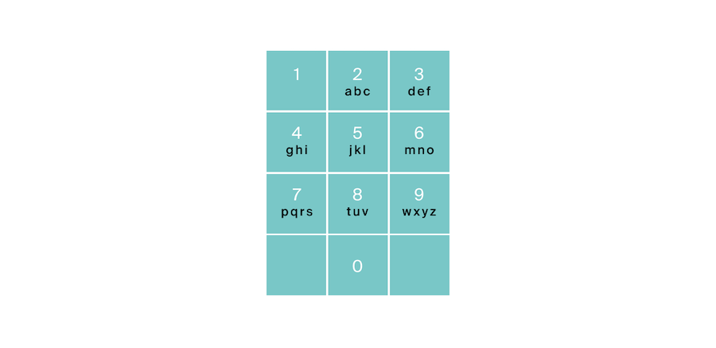

<h1 align="center">B. Комбинации</h1>

<h5 align="center">
<a href="#limits">Ограничения</a>
•
<a href="#task">Условие задачи</a>
•
<a href="#input">Формат ввода</a>
•
<a href="#output">Формат вывода</a>
•
<a href="#examples">Примеры</a>
•
<a href="#solution">Решение</a>
</h5>

<br>

<table id="limits">
<tbody>
<tr>
<td>
<b>Ограничение времени</b>
</td>
<td>
1 секунд
</td>
</tr>
<tr>
<td>
<b>Ограничение памяти</b>
</td>
<td>
64Mb
</td>
</tr>
<tr>
<td>
<b>Ввод</b>
</td>
<td>
стандартный ввод или input.txt
</td>
</tr>
<tr>
<td>
<b>Вывод</b>
</td>
<td>
стандартный вывод или output.txt
</td>
</tr>
</tbody>
</table>

<h2 id="task">Условие задачи</h2>

На клавиатуре старых мобильных телефонов каждой цифре соответствовало несколько букв. Примерно так:

2:'abc',
3:'def',
4:'ghi',
5:'jkl',
6:'mno',
7:'pqrs',
8:'tuv',
9:'wxyz'

Вам известно в каком порядке были нажаты кнопки телефона, без учета повторов. Напечатайте все комбинации букв, которые можно набрать такой последовательностью нажатий.



<h2 id="input">Формат ввода</h2>

На вход подается строка, состоящая из цифр 2-9 включительно. Длина строки не превосходит 10 символов.

<h2 id="output">Формат вывода</h2>

Выведите все возможные комбинации букв через пробел.

<h2 id="examples">Примеры</h2>

<h4>Пример 1</h4>
<ul>
<h6>Ввод</h6>
<pre>
23
</pre>

<h6>Вывод</h6>
<pre>
ad ae af bd be bf cd ce cf
</pre>
</ul>

<hr>

<h4>Пример 2</h4>
<ul>
<h6>Ввод</h6>
<pre>
92
</pre>

<h6>Вывод</h6>
<pre>
wa wb wc xa xb xc ya yb yc za zb zc
</pre>
</ul>

<h2 id="solution">Решение</h2>

```javascript
function combinations() {
  const readline = require('readline');
  const io_interface = readline.createInterface({input: process.stdin});

  const LETTERS = {
    TWO: 'abc',
    THREE: 'def',
    FOUR: 'ghi',
    FIVE: 'jkl',
    SIX: 'mno',
    SEVEN: 'pqrs',
    EIGHT: 'tuv',
    NINE: 'wxyz',
  };

  const KEY = {
    TWO: '2',
    THREE: '3',
    FOUR: '4',
    FIVE: '5',
    SIX: '6',
    SEVEN: '7',
    EIGHT: '8',
    NINE: '9',
  };

  function getLetters(string) {
    const letters = [];
    for (let key of string) {
      switch (key) {
        case KEY.TWO:
          letters.push(LETTERS.TWO);
          break;
        case KEY.THREE:
          letters.push(LETTERS.THREE);
          break;
        case KEY.FOUR:
          letters.push(LETTERS.FOUR);
          break;
        case KEY.FIVE:
          letters.push(LETTERS.FIVE);
          break;
        case KEY.SIX:
          letters.push(LETTERS.SIX);
          break;
        case KEY.SEVEN:
          letters.push(LETTERS.SEVEN);
          break;
        case KEY.EIGHT:
          letters.push(LETTERS.EIGHT);
          break;
        case KEY.NINE:
          letters.push(LETTERS.NINE);
          break;
      }
    }
    return letters;
  }

  function getCombinations(letters, ans, button, letter) {
    if (button < letters.length) {
      for (let sym of letters[button]) {
        getCombinations(letters, ans + sym, button + 1, letter);
      }
    } else {
      letter.push(ans);
    }
  }

  io_interface.on('line', function (line) {
    const result = [];
    getCombinations(getLetters(line), '', 0, result);
    console.log(result.join(' '));
  });
}

combinations();
```
<table>
  <thead>
    <tr>
      <th>Вердикт</th>
      <th>Компилятор</th>
      <th>Время</th>
      <th>Память</th>
    </tr>
  </thead>
  <tbody>
<tr align="center">
<td>OK</td>
<td>Node.js 14.15.5</td>
<td>82ms</td>
<td>10.16Mb</td>
</tr>
  </tbody>
</table>