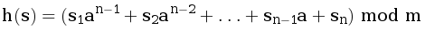

<h1 align="center">J. Факторизация</h1>

<h5 align="center">
<a href="#limits">Ограничения</a>
•
<a href="#task">Условие задачи</a>
•
<a href="#input">Формат ввода</a>
•
<a href="#output">Формат вывода</a>
•
<a href="#examples">Примеры</a>
•
<a href="#solution">Решение</a>
</h5>

<br>

<table id="limits">
<tbody>
<tr>
<td>
<b>Ограничение времени</b>
</td>
<td>
5 секунд
</td>
</tr>
<tr>
<td>
<b>Ограничение памяти</b>
</td>
<td>
128Mb
</td>
</tr>
<tr>
<td>
<b>Ввод</b>
</td>
<td>
стандартный ввод или input.txt
</td>
</tr>
<tr>
<td>
<b>Вывод</b>
</td>
<td>
стандартный вывод или output.txt
</td>
</tr>
</tbody>
</table>

<h2 id="task">Условие задачи</h2>

Алла не остановилась на достигнутом –— теперь она хочет научиться быстро вычислять хеши произвольных подстрок данной строки. Помогите ей!

На вход поступают запросы на подсчёт хешей разных подстрок. Ответ на каждый запрос должен выполняться за O(1). Допустимо в начале работы программы сделать предподсчёт для дальнейшей работы со строкой.

Напомним, что полиномиальный хеш считается по формуле


В данной задаче необходимо использовать в качестве значений отдельных символов их коды в таблице ASCII.

<h2 id="input">Формат ввода</h2>

В первой строке дано число <i>a</i> (<i>1 ≤ a ≤ 1000</i>) –— основание, по которому считается хеш. Во второй строке дано число <i>m</i> (<i>1 ≤ m ≤ 10<sup>7</sup></i>) –— модуль. В третьей строке дана строка <i>s</i> (<i>0 ≤ |s| ≤ 10<sup>6</sup></i>), состоящая из больших и маленьких латинских букв.

В четвертой строке дано число запросов t –— натуральное число от <i>1</i> до <i>10<sup>5</sup></i>. В каждой из следующих <i>t</i> строк записаны через пробел два числа <i>l</i> и <i>r</i> –— индексы начала и конца очередной подстроки. (<i>1 ≤ l ≤ r ≤ |s|</i>).

<h2 id="output">Формат вывода</h2>

Для каждого запроса выведите на отдельной строке хеш заданной в запросе подстроки.

<h2 id="examples">Примеры</h2>

<h4>Пример 1</h4>
<ul>
<h6>Ввод</h6>
<pre>
1000
1000009
abcdefgh
7
1 1
1 5
2 3
3 4
4 4
1 8
5 8
</pre>

<h6>Вывод</h6>
<pre>
97
225076
98099
99100
100
436420
193195
</pre>
</ul>

<hr>

<h4>Пример 2</h4>
<ul>
<h6>Ввод</h6>
<pre>
100
10
a
1
1 1
</pre>

<h6>Вывод</h6>
<pre>
7
</pre>
</ul>

<h2 id="solution">Решение</h2>

```javascript

```
<table>
  <thead>
    <tr>
      <th>Вердикт</th>
      <th>Компилятор</th>
      <th>Время</th>
      <th>Память</th>
    </tr>
  </thead>
  <tbody>
<tr align="center">
<td>OK</td>
<td>Node.js 14.15.5</td>
<td>73ms</td>
<td>7.00Mb</td>
</tr>
  </tbody>
</table>