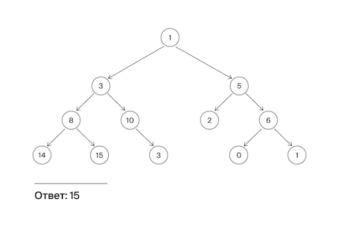

<h1 align="center">A. Лампочки</h1>

<h5 align="center">
<a href="#limits">Ограничения</a>
•
<a href="#task">Условие задачи</a>
•
<a href="#input">Формат ввода</a>
•
<a href="#output">Формат вывода</a>
•
<a href="#solution">Решение</a>
</h5>

<br>

<table id="limits">
<tbody>
<tr>
<td>
<b>Ограничение времени</b>
</td>
<td>
1 секунда
</td>
</tr>
<tr>
<td>
<b>Ограничение памяти</b>
</td>
<td>
64Mb
</td>
</tr>
<tr>
<td>
<b>Ввод</b>
</td>
<td>
стандартный ввод или input.txt
</td>
</tr>
<tr>
<td>
<b>Вывод</b>
</td>
<td>
стандартный вывод или output.txt
</td>
</tr>
</tbody>
</table>

<h2 id="task">Условие задачи</h2>

Гоша повесил на стену гирлянду в виде бинарного дерева, в узлах которого находятся лампочки. У каждой лампочки есть своя яркость. Уровень яркости лампочки соответствует числу, расположенному в узле дерева. Помогите Гоше найти самую яркую лампочку в гирлянде, то есть такую, у которой яркость наибольшая.



<h2 id="input">Формат ввода</h2>

На вход подается корень дерева.

<h2 id="output">Формат вывода</h2>

Функция должна вернуть максимальное значение яркости в узле дерева.

<h2 id="solution">Решение</h2>

```javascript
function solution(root) {
  let left, right;
  if (root.left === null && root.right === null) {
    return root.value;
  }
  if (root.left) {
    left = solution(root.left);
  }
  if (root.right) {
    right = solution(root.right);
  }
  if (!isNaN(left) && !isNaN(right)) {
    return Math.max(left, right, root.value);
  } else if (isNaN(left)) {
    return Math.max(right, root.value);
  } else if (isNaN(right)) {
    return Math.max(left, root.value);
  }
}
```
<table>
  <thead>
    <tr>
      <th>Вердикт</th>
      <th>Компилятор</th>
      <th>Время</th>
      <th>Память</th>
    </tr>
  </thead>
  <tbody>
<tr align="center">
<td>OK</td>
<td>Make</td>
<td>87ms</td>
<td>7.73Mb</td>
</tr>
  </tbody>
</table>

<p width="100%" align="right"><a href="#">🔝</a></p>