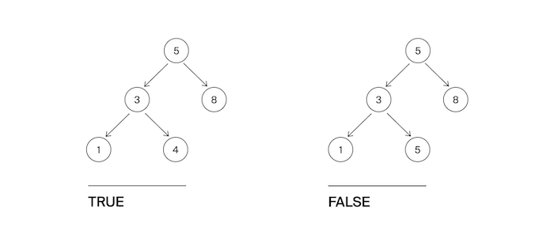

<h1 align="center">E. Дерево поиска</h1>

<h5 align="center">
<a href="#limits">Ограничения</a>
•
<a href="#task">Условие задачи</a>
•
<a href="#input">Формат ввода</a>
•
<a href="#output">Формат вывода</a>
•
<a href="#solution">Решение</a>
</h5>

<br>

<table id="limits">
<tbody>
<tr>
<td>
<b>Ограничение времени</b>
</td>
<td>
1 секунда
</td>
</tr>
<tr>
<td>
<b>Ограничение памяти</b>
</td>
<td>
64Mb
</td>
</tr>
<tr>
<td>
<b>Ввод</b>
</td>
<td>
стандартный ввод или input.txt
</td>
</tr>
<tr>
<td>
<b>Вывод</b>
</td>
<td>
стандартный вывод или output.txt
</td>
</tr>
</tbody>
</table>

<h2 id="task">Условие задачи</h2>

Гоша понял, что такое дерево поиска, и захотел написать функцию, которая определяет, является ли заданное дерево деревом поиска. Значения в левом поддереве должны быть строго меньше, в правом —- строго больше значения в узле.
Помогите Гоше с реализацией этого алгоритма.



<h2 id="input">Формат ввода</h2>

На вход подается корень дерева.

<h2 id="output">Формат вывода</h2>

Функция должна вернуть True, если дерево является деревом поиска, иначе - False.

<h2 id="solution">Решение</h2>

```javascript
function solution(root) {
  function isBST(curNode, min, max){
    if (curNode == null) {
      return true;
    }
    return (
      (min == null || min < curNode.value) &&
      (max == null || max > curNode.value) &&
      isBST(curNode.left, min, curNode.value) &&
      isBST(curNode.right, curNode.value, max)
    );
  }
  return isBST(root, null, null);
}
```
<table>
  <thead>
    <tr>
      <th>Вердикт</th>
      <th>Компилятор</th>
      <th>Время</th>
      <th>Память</th>
    </tr>
  </thead>
  <tbody>
<tr align="center">
<td>OK</td>
<td>Make</td>
<td>76ms</td>
<td>7.70Mb</td>
</tr>
  </tbody>
</table>

<p width="100%" align="right"><a href="#">🔝</a></p>