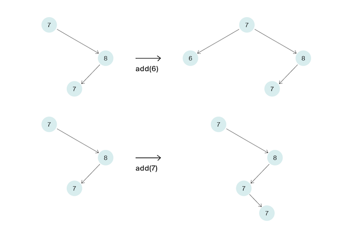

<h1 align="center">J. Добавь узел</h1>

<h5 align="center">
<a href="#limits">Ограничения</a>
•
<a href="#task">Условие задачи</a>
•
<a href="#input">Формат ввода</a>
•
<a href="#output">Формат вывода</a>
•
<a href="#solution">Решение</a>
</h5>

<br>

<table id="limits">
<tbody>
<tr>
<td>
<b>Ограничение времени</b>
</td>
<td>
3 секунды
</td>
</tr>
<tr>
<td>
<b>Ограничение памяти</b>
</td>
<td>
128Mb
</td>
</tr>
<tr>
<td>
<b>Ввод</b>
</td>
<td>
стандартный ввод или input.txt
</td>
</tr>
<tr>
<td>
<b>Вывод</b>
</td>
<td>
стандартный вывод или output.txt
</td>
</tr>
</tbody>
</table>

<h2 id="task">Условие задачи</h2>

Дано BST. Надо вставить узел с заданным ключом. Ключи в дереве могут повторяться.
На вход функции подаётся корень корректного бинарного дерева поиска и ключ, который надо вставить в дерево. Осуществите вставку этого ключа. Если ключ уже есть в дереве, то его дубликаты уходят в правого сына. Таким образом вид дерева после вставки определяется однозначно. Функция должна вернуть корень дерева после вставки вершины.
Ваше решение должно работать за
O
(
h
)
, где
h
–— высота дерева.
На рисунках ниже даны два примера вставки вершин в дерево.



<h2 id="input">Формат ввода</h2>

Ключи дерева – натуральные числа, не превосходящие
1
0
9
. Число вершин в дереве не превосходит
1
0
5
.
<h2 id="output">Формат вывода</h2>

Функция должна вернуть корень дерева после вставки вершины.

<h2 id="solution">Решение</h2>

```javascript
function insert(node, key) {
  if (key < node.value) {
    if (node.left === null) {
      node.left = new Node(key);
    } else {
      insert(node.left, key);
    }
  }
  if (key >= node.value) {
    if (node.right === null) {
      node.right = new Node(key);
    } else {
      insert(node.right, key);
    }
  }
  return node;
}
```
<table>
  <thead>
    <tr>
      <th>Вердикт</th>
      <th>Компилятор</th>
      <th>Время</th>
      <th>Память</th>
    </tr>
  </thead>
  <tbody>
<tr align="center">
<td>OK</td>
<td>Make</td>
<td>2.077s</td>
<td>72.07Mb</td>
</tr>
  </tbody>
</table>

<p width="100%" align="right"><a href="#">🔝</a></p>