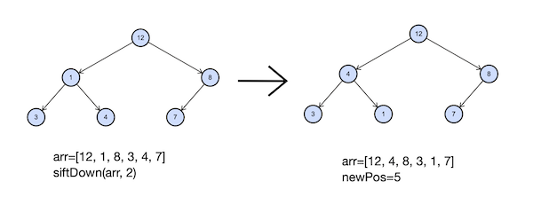

<h1 align="center">L. Просеивание вниз</h1>

<h5 align="center">
<a href="#limits">Ограничения</a>
•
<a href="#task">Условие задачи</a>
•
<a href="#input">Формат ввода</a>
•
<a href="#output">Формат вывода</a>
•
<a href="#solution">Решение</a>
</h5>

<br>

<table id="limits">
<tbody>
<tr>
<td>
<b>Ограничение времени</b>
</td>
<td>
2 секунды
</td>
</tr>
<tr>
<td>
<b>Ограничение памяти</b>
</td>
<td>
80Mb
</td>
</tr>
<tr>
<td>
<b>Ввод</b>
</td>
<td>
стандартный ввод или input.txt
</td>
</tr>
<tr>
<td>
<b>Вывод</b>
</td>
<td>
стандартный вывод или output.txt
</td>
</tr>
</tbody>
</table>

<h2 id="task">Условие задачи</h2>

Напишите функцию, совершающую просеивание вниз в куче на максимум. Гарантируется, что порядок элементов в куче может быть нарушен только элементом, от которого запускается просеивание.
Функция принимает в качестве аргументов массив, в котором хранятся элементы кучи, и индекс элемента, от которого надо сделать просеивание вниз. Функция должна вернуть индекс, на котором элемент оказался после просеивания. Также необходимо изменить порядок элементов в переданном в функцию массиве.
Индексация в массиве, содержащем кучу, начинается с единицы. Таким образом, сыновья вершины на позиции
v
это
2
v
и
2
v+1. Обратите внимание, что нулевой элемент в передаваемом массиве фиктивный, вершина кучи соответствует 1-му элементу.



<h2 id="input">Формат ввода</h2>

Элементы кучи —– целые числа, лежащие в диапазоне от
−
1
0
9
до
1
0
9
. Все элементы кучи уникальны. Передаваемый в функцию индекс лежит в диапазоне от 1 до размера передаваемого массива. В куче содержится от
1
до
1
0
5
элементов.

<h2 id="output">Формат вывода</h2>

Функция должна вернуть индекс, на котором элемент оказался после просеивания. Также необходимо изменить порядок элементов в переданном в функцию массиве.

<h2 id="solution">Решение</h2>

```javascript
function siftDown(heap, idx) {
  const heapSize = heap.length;
  while (2 * idx < heapSize) {
    let left = 2 * idx;
    let right = 2 * idx + 1;
    let largest = left;
    if (right < heapSize && heap[right] > heap[left]) {
      largest = right;
    }
    if (heap[idx] >= heap[largest]) break;
    [heap[idx], heap[largest]] = [heap[largest], heap[idx]];
    idx = largest;
  }
  return idx;
}
```
<table>
  <thead>
    <tr>
      <th>Вердикт</th>
      <th>Компилятор</th>
      <th>Время</th>
      <th>Память</th>
    </tr>
  </thead>
  <tbody>
<tr align="center">
<td>OK</td>
<td>Make</td>
<td>0.508s</td>
<td>46.84Mb</td>
</tr>
  </tbody>
</table>

<p width="100%" align="right"><a href="#">🔝</a></p>